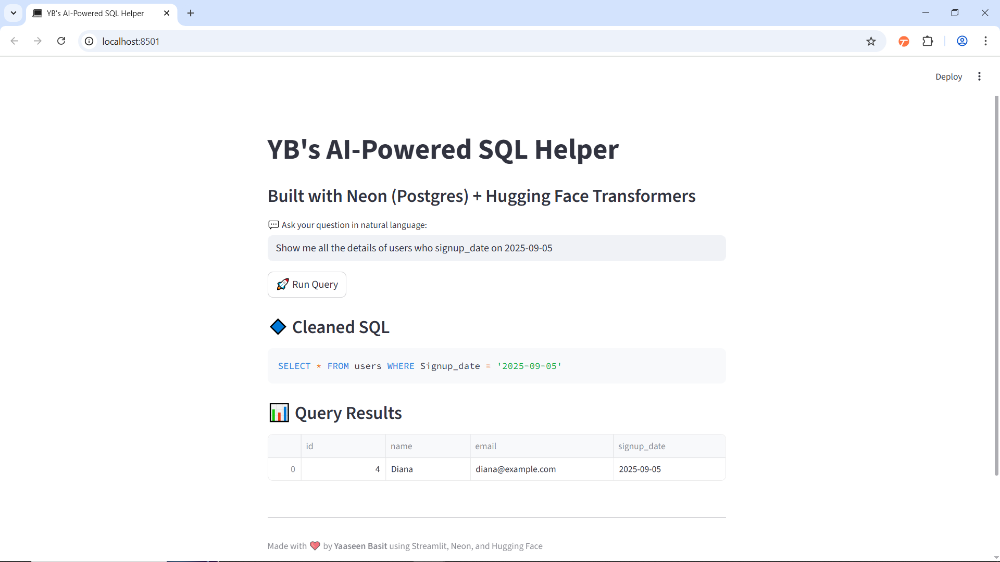

#  AI-Powered SQL Helper

Generate **SQL queries from natural language** using a fine-tuned **T5 model** and execute them directly on **Neon Postgres**. This project demonstrates how **AI + serverless Postgres** can simplify database queries for developers.

---

## 🌟 Features

- 🧠 Translate **natural language questions → SQL queries** using Hugging Face T5 (WikiSQL)
- 🚀 Execute queries directly on **Neon Postgres**
- 🌿 Supports **Neon database features** (branching, serverless scaling)
- 📊 Responsive **Streamlit UI** for easy query testing
- 🛠 Cleaned SQL output with automatic synonym and date handling

---

## 🎥 Demo



1. Enter your question in natural language
2. AI generates SQL
3. SQL executed on Neon Postgres
4. Query results displayed in a table

---

## 🛠 Tech Stack

- Python 3.11
- Streamlit (UI)
- Hugging Face Transformers (`mrm8488/t5-base-finetuned-wikiSQL`)
- Neon Postgres (Serverless)
- SQLAlchemy, Pandas

---

## 🚀 Installation & Setup

```bash
# Clone repo
git clone https://github.com/yourusername/ai-sql-helper.git
cd ai-sql-helper

# Install dependencies
pip install -r requirements.txt
